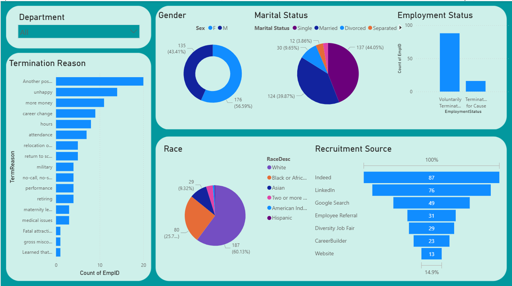
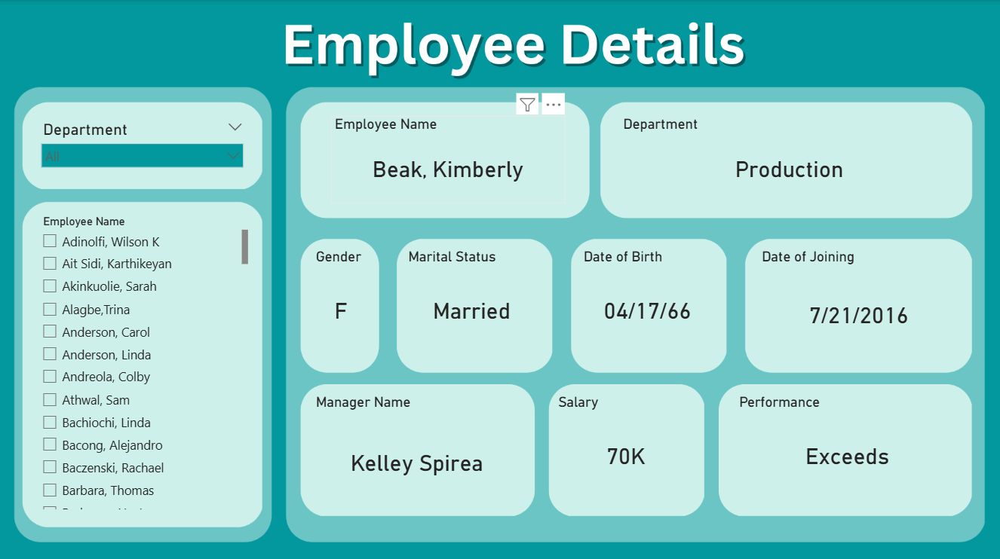

#  Employee Attrition & Demographics Dashboard

## Project Overview

This repository contains a **Microsoft Power BI** report designed to analyze key aspects of **employee demographics, termination patterns, and individual employee details**. The dashboard provides HR and management teams with actionable insights to understand employee turnover, identify potential areas for intervention, and support workforce planning.

##  Key Objectives

* **Analyze Termination Reasons:** Determine the most common reasons employees leave the organization.
* **Identify Demographic Trends:** Understand the distribution of employees by **Gender, Marital Status, and Race**.
* **Track Recruitment Sources:** Identify the most effective channels for sourcing new talent.
* **Provide Individual Details:** Offer a quick reference view for specific employee records, including salary and performance.

---

##  Dashboard Pages & Key Metrics

The Power BI file is organized into two main pages:

### 1. Employee Attrition & Demographics Summary (Dashboard 1)

This page provides a high-level overview of the workforce data.

### 2. Employee Details (Dashboard 2)

This page is designed for looking up specific employee information.

